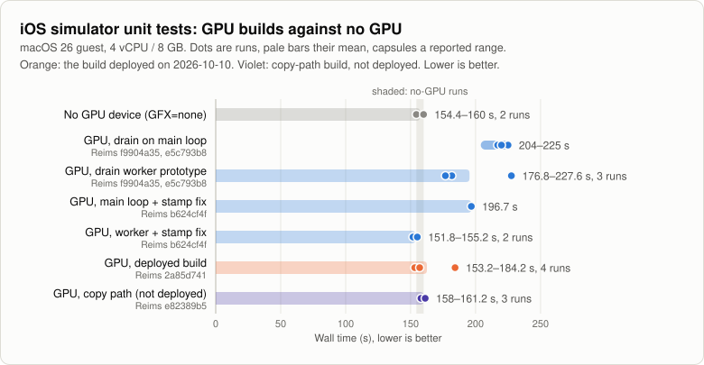
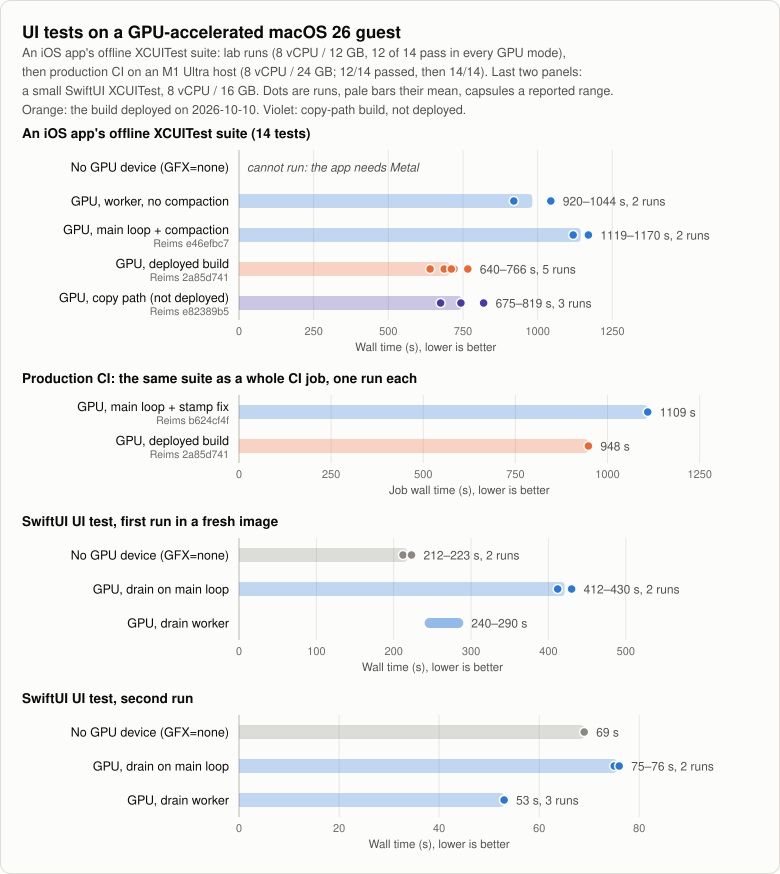
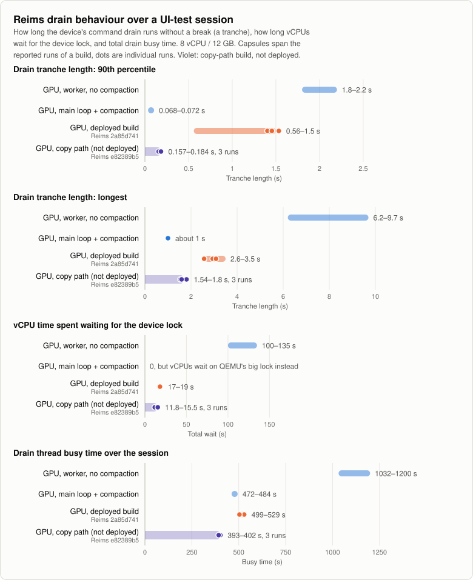
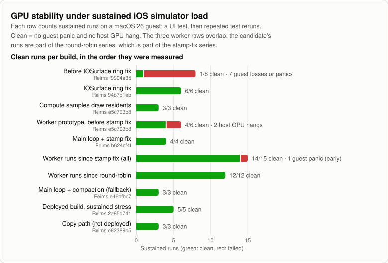
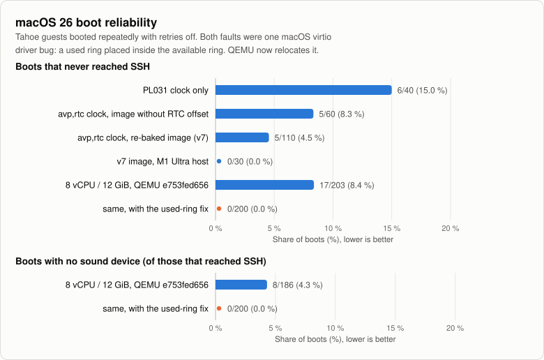
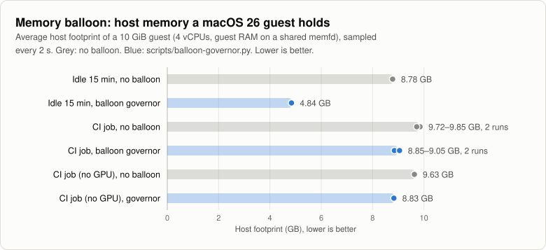

# Performance and reliability

What the macOS-guest work on Asahi Linux has reached, measured. State as of
2026-10-10. The charts are drawn from the CSV files in
[benchmarks/data/](benchmarks/data/) by
[`scripts/plot-benchmarks.py`](../scripts/plot-benchmarks.py); see
[How to update](#how-to-update).

macOS 13 (Ventura) and macOS 26 (Tahoe) guests run under QEMU's `vmapple`
machine with KVM on Fedora Asahi Remix, on Apple silicon Macs. They serve as
ephemeral CI runners for Xcode and iOS-simulator jobs. Reims is the
paravirtual Metal device: the guest's Metal commands are translated
(metal2vulkan) and run on the host's GPU through Vulkan (Mesa's Honeykrisp
driver).

## Highlights

- macOS 26 guests with GPU-accelerated Metal run on Linux. With the
  2026-10-10 build, CPU-bound simulator unit tests take 155.8 s with the GPU
  device, against 154.4 s and 160.0 s without it.
- An iOS app's 14-test XCUITest suite takes 640–766 s on that build, against
  1119–1170 s with the drain on QEMU's main loop: about 1.6x faster. Without
  a GPU the app cannot run its UI tests at all.
- In production CI, the first UI-test job on the 2026-10-10 build passed all
  14 tests for the first time and took 15.8 min, against 18.5 min and 12 of
  14 the day before. That commit also raised two test waits from 10 s to
  30 s, so not all of the gain is the GPU build's.
- A small SwiftUI UI test, run a second time, takes 53 s with the GPU and
  the drain worker, and 69 s without a GPU. The app reaches idle in 3 s instead of 22 s (software
  rendering).
- The longest uninterrupted device drain fell from 6.2–9.7 s to 2.6–3.5 s.
  vCPU time lost waiting for the device fell from 100–135 s to 17–19 s per
  session.
- Under sustained simulator load: 12 of 12 runs clean since the round-robin
  drain, 5 of 5 sustained stress runs on the deployed build (183 of 183 UI
  loops), no guest panic and no host GPU hang.
- macOS 26 boots that never reached SSH: 17 of 203 before the virtio
  used-ring fix, 0 of 200 after. Boots without a sound device: 8 of 186,
  then 0 of 200.
- The memory balloon nearly halves what an idle guest holds on the host:
  4.84 GB on average instead of 8.78 GB for a 10 GiB guest.

## Charts

### Simulator unit tests

With the drain on QEMU's main loop, GPU guests took 204–225 s, well behind
the no-GPU runs; the first drain-worker prototype took 177–228 s. The stamp
fix brought the main-loop drain to 196.7 s. The drain worker on top of it
brought GPU guests into the no-GPU band (shaded), and the final build stays
there.

### UI tests

Top: the app's suite is about 1.6x faster on the final build than with the
drain on the main loop. Second: the same suite as a production CI job, one
run per build; the 2026-10-10 run passed 14 of 14 (12 of 14 before), with
two test waits raised from 10 s to 30 s in the same commit and an unrelated
low-priority CPU load on the host, so its time is conservative. Below: with the drain worker a small SwiftUI test is
faster with the GPU than without one once the simulator is warm; the first
run in a fresh image still pays for one-off simulator setup in every mode.

### Drain behaviour

A tranche is how long the device drains guest commands without a break. The
main-loop build has the shortest tranches, but its vCPUs wait behind QEMU's
big lock instead, which showed up as dropped SSH sessions. The final build
keeps the worker. Against the worker build without compaction it cuts the
longest tranche by more than half and the vCPU wait by over 80 %.

### Stability

Before the IOSurface ring fix, 7 of 8 long runs lost the guest. Every series
since has been clean except the worker prototype before the stamp fix (two
host GPU hangs) and one early guest panic in the worker series.

### Boot reliability

The real-time clock work lowered the early-boot stall, but it only went away
with the used-ring relocation in QEMU, which also fixed the missing sound
device.

### Memory balloon

The governor gives an idle guest's spare memory back to the host. During a
job that needs nearly all of its 10 GiB, it hands the memory back to the
guest and the average saving is small. Peaks: 10.09 GB idle without the
balloon against 6.67 GB with it; about 10.5 GB for the job either way.

## How the bugs were found

On the production GPU slot the guest stalled for several seconds at a time,
and UI tests appeared to run about 4x slower than without the GPU. The causes were
separate bugs, found one at a time from Reims' per-run event counts, `perf`
profiles and guest crash data.

- **A completion was reported out of order.** When the device refused a
  command packet, it wrote that packet's completion word at once, even if
  an earlier packet in the same channel was still queued. The guest read
  the word as "everything up to here is done", freed the earlier packet's
  objects and reused its memory. The queued packet then ran on garbage: in
  one case a Core Animation compute kernel read float data as a loop count,
  ran about a billion iterations and the host GPU timed the job out. Fix:
  hold the word until the channel reaches it (Reims 0d7da8e277).
- **Object ids collided across guest processes.** Each guest process
  numbered its objects from 1, and the device keyed some state on the number
  alone. Three processes with a pipeline in the same slot shared one entry,
  which caused 362 refused packets in one run. Fix: a separate number range
  per process (Reims 0e07f1b6a9).
- **The dependency graph never shrank.** Finished work was marked dead but
  never removed, so admitting each new packet walked the whole session's
  history. Twenty minutes into a UI-test session that was 30 % of the drain's
  CPU time, spent while holding QEMU's big lock. Fix: compact the graph as
  part of admission (Reims e46efbc7eb). It no longer shows in the profile.
- **The drain ran under QEMU's big lock.** The device drained in a main-loop
  bottom half, so every vCPU exit that needed the lock waited out the whole
  tranche. Fix: drain on a worker thread (QEMU 2cd151d3b4), end a tranche at
  the next packet when a vCPU waits for the device (Reims b624cf4fc5), and
  take busy channels in turns of one packet (Reims a77ea84fce).

Earlier fixes on the way to a stable GPU guest:

- **The IOSurface request ring was read without wrapping.** Once the guest's
  request counter passed the ring size, every map and unmap request was read
  from beyond the ring and lost. The guest freed surface memory that the
  device kept writing frames into, and the guest kernel panicked with
  corrupted page tables. One fault address was a half-float pixel value in a
  kernel pointer. Fix: Reims 94b7d1eb22.
- **The device described itself before it existed.** The guest asks for the
  GPU's limits once per boot, before the first draw, and got the Vulkan
  floor: one sample per pixel. The iOS simulator then created 4x MSAA
  textures, Metal's validation aborted the simulator's GPU host process, and
  SpringBoard restarted in a loop. Fix: bring the device up first (Reims
  f9904a3538).
- **A used ring inside the available ring.** macOS 26's virtio driver
  sometimes programs a used-ring address that lies inside the available
  ring. Completions then land where the driver never looks: on the network
  control queue the guest never configures its network (the boot stall); on
  the sound control queue the sound device never registers. Fix: QEMU
  relocates such a used ring (`x-fix-overlapping-used`, QEMU 607c56b16d).

Known gaps on the deployed build:

- Pipelines with no fragment function are refused, so screenshots of
  Compose/Skia apps are mostly flat colour. Being fixed.
- After compaction, `memcpy` is 70 % of the drain's CPU time. About 44 %
  of that is an extra copy through an intermediate buffer, which can go.

## Methodology

- **Hosts:** an Apple M1 Max Mac (MacBook Pro class) for the measurements
  here, except the "M1 Ultra host" boot row. Fedora Asahi Remix 44, Asahi 16K
  kernel 7.1 with this repository's KVM patches, QEMU from
  aquarat/qemu-reims-vgpu, Reims from aquarat/reims-vgpu, Mesa Honeykrisp
  with the varying fix (`scripts/build-mesa-honeykrisp.sh`).
- **Guest:** macOS 26.4 (25E246), Xcode 26.4.1, iOS 26.4.1 simulator
  runtime, images built as in [IMAGES.md](IMAGES.md). Guest size per
  benchmark is given on each chart.
- **Simulator unit tests:** wall time of the simulator unit-test phase of a
  benchmark script, 4 vCPU / 8 GB guest.
- **App XCUITest suite:** an iOS app's 14 offline XCUITests from prebuilt
  test products, 8 vCPU / 12 GB guest. 12 of 14 pass in every GPU mode; the
  two failures are waits on system dialogs (a document picker and an import
  confirmation). The app is built with
  Compose Multiplatform and crashes or never renders without Metal.
- **Production CI job:** the same 14 UI tests as one job on the GPU slot of
  an M1 Ultra host (8 vCPU / 24 GB guest), timed from job start to end
  including setup before and after the tests. The tests themselves summed
  to about 403 s on the 2026-10-10 run.
- **SwiftUI UI test:** one small XCUITest, 8 vCPU / 16 GB. "First run" is
  the first `xcodebuild test` in a fresh image (it includes about two minutes
  of one-off simulator setup in every mode); "second run" repeats it after
  shutting the simulator down.
- **Drain figures:** Reims' own counters over a UI-test session; each
  capsule spans the runs of one build.
- **Sustained runs:** a UI test followed by repeated test reruns ("loops").
  A run is clean with no guest panic and no host GPU job timeout.
- **Boots:** [`scripts/debug/boot-reliability.sh`](../scripts/debug/boot-reliability.sh),
  retries off; a boot fails if SSH never answers.
- **Balloon:** see "Memory balloon" in [NOTES.md](NOTES.md). The host was
  shared with other VMs, so wall times varied by about ±15 %.
- Every value is a measured run or a range reported for a set of runs. The
  `source` column of each CSV says where it came from.

## How to update

1. Add rows to the CSV in [benchmarks/data/](benchmarks/data/), one row per
   run:
   - `unit-test.csv`, `ui-tests.csv`, `balloon.csv`, `copy-path.csv`:
     `date,series,run,reims,qemu,metric,value,unit,source`.
   - `ranges.csv`: results known only as a range, or a note such as "cannot
     run".
   - `reliability.csv`: clean and total sustained runs per build.
   - `boot.csv`: failures and boots per configuration.
2. A new build needs a line in `series.csv` (label, colour role
   `reference`, `main` or `highlight`, description). Rows follow the order
   of `series.csv`, so keep it chronological. A new metric needs a line in
   `metrics.csv`.
3. Run `scripts/plot-benchmarks.py` (Python 3, standard library only). It
   rewrites `docs/benchmarks/*.svg`. `--check` validates the data without
   writing anything.
4. Update the highlights above if a headline number changed.

`copy-path.csv` is ready for measurements of the guest-memory copy path
(the second copy noted above); `copy-path.svg` appears once it has rows.
